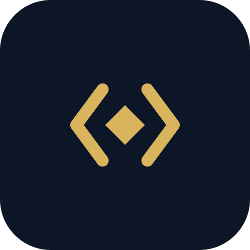

# Open Coder AI

**Governance as code for AI coding agents — and an honest account of where it holds.**

Build for every AI coding agent at once: hooks, plugins and rules through one API, with
governance and evidence on top. Claims match mechanisms.

## The rule we hold ourselves to

> A rule an agent reads is advice. A hook that exits non-zero is a control. Both belong in
> a repo, and the difference has to be visible.

## What we build

| | |
|---|---|
| [agentseam](https://github.com/open-coder-ai/agentseam) | the primitives — one handler API and a verified capability matrix across 16 agents |
| [chock](https://github.com/open-coder-ai/chock) | the compiler — one policy into git hooks, CI gates and native pre-tool hooks |
| [chock-catalog](https://github.com/open-coder-ai/chock-catalog) | the policies — 39, each labelled enforced or advisory, with replayed evals |
| [context-report](https://github.com/open-coder-ai/context-report) | the evidence — a signed report of whether an agent artifact actually works |
| [chock-threat-intel](https://github.com/open-coder-ai/chock-threat-intel) | the threat ledger the catalog's policies answer to |

**Start here.** If your repo receives agent-written commits, start with
[chock](https://github.com/open-coder-ai/chock). If you build hooks or plugins, start with
[agentseam](https://github.com/open-coder-ai/agentseam). If you maintain a catalog, start
with [context-report](https://github.com/open-coder-ai/context-report).

**Help wanted.** [Open `good first issue`s across the org](https://github.com/search?q=org%3Aopen-coder-ai+label%3A%22good+first+issue%22+state%3Aopen&type=issues).
